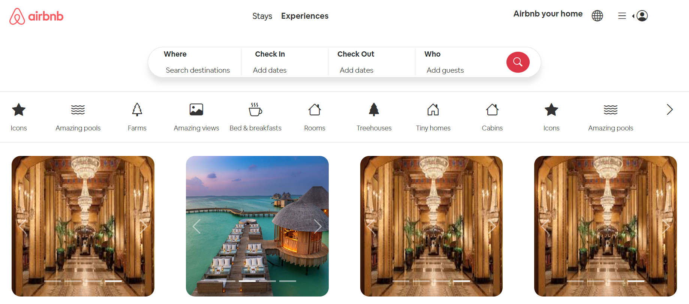
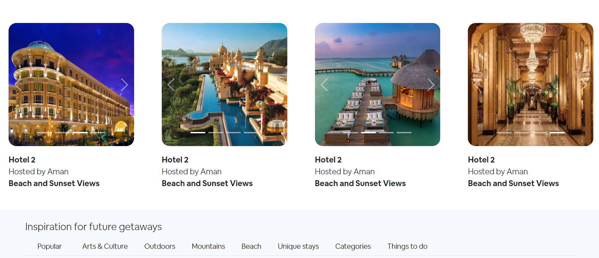
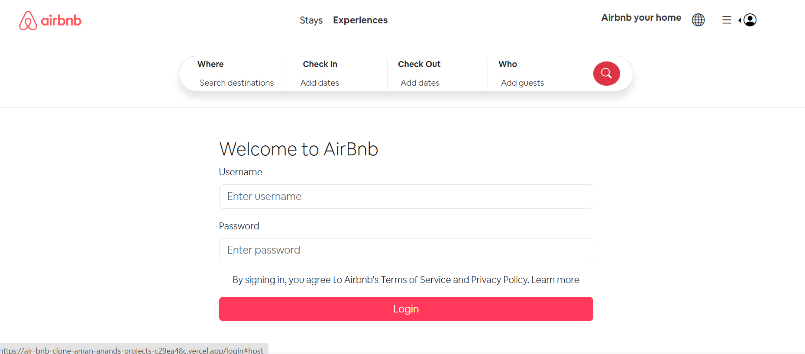
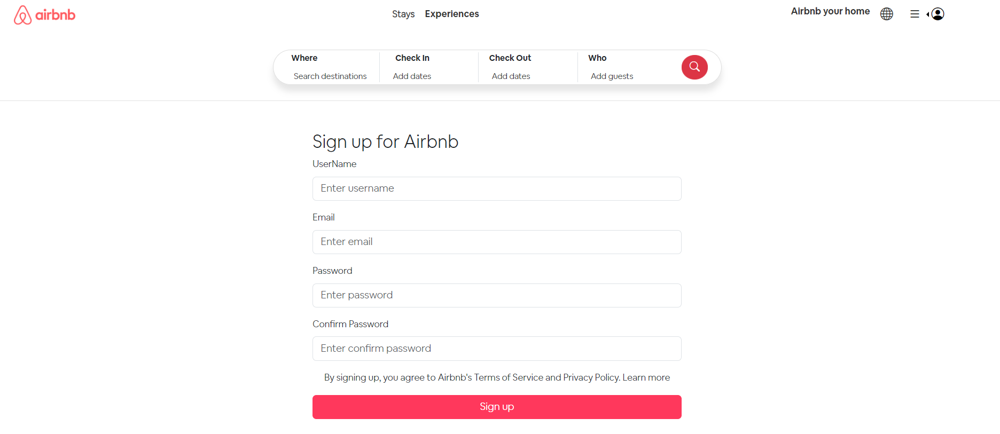

# Airbnb Clone Project

This is a full-stack **Airbnb Clone** application built using **NestJS** for the backend and **Vite + React** for the frontend. The app replicates core functionalities of Airbnb, including listings, bookings, user authentication, and more.

<div align="center">
   
   
   
   
</div>

## Live Demo

- **Frontend**: [Airbnb Clone Frontend](https://air-bnb-clone-aman-anands-projects-c29ea48c.vercel.app/)
- **Backend**: [Airbnb Clone Backend](https://airbnbclone-8twl.onrender.com/)
- **Postman Collection**: [Postman API Documentation](https://documenter.getpostman.com/view/37574505/2sAXjRWps2)

## Tech Stack

| **Backend**        | **Frontend**  | **Database**  | **Tools**          |
| ------------------ | ------------- | ------------- | ------------------ |
| NestJS             | Vite          | MongoDB Atlas | Postman API Docs   |
| MongoDB (Mongoose) | React         |               | JWT Authentication |
| JWT Authentication | Bootstrap CSS |               |                    |

---

## Features

- **User Authentication**: Register, login, and authentication using JWT tokens.
- **Property Listings**: Browse all available property listings with detailed descriptions and images.

## Screenshots

| Home                         | Property Catalog                |
| ---------------------------- | ------------------------------- |
|  |  |

| Login Page                    | Signup Page                    |
| ----------------------------- | ------------------------------ |
|  |  |

---

## Installation

### Prerequisites

Ensure that you have the following installed:

- **Node.js** (>=14.x)
- **npm** or **yarn**
- **MongoDB** (Local or MongoDB Atlas)

### Clone the Repository

```bash
git clone https://github.com/amanand2507/AirBnbClone.git
cd airbnb-clone
```

### Backend Setup

1. Navigate to the backend directory:

   ```bash
   cd backend
   ```

2. Install dependencies:

   ```bash
   npm install
   ```

3. Create a `.env` file in the backend directory with the following content:

   ```bash
   MONGO_URL=your-mongodb-connection-string
   ```

4. Run the backend server:

   ```bash
   npm run start
   ```

   The backend API will be running at `http://localhost:3000`.

### Frontend Setup

1. Navigate to the frontend directory:

   ```bash
   cd client
   ```

2. Install dependencies:

   ```bash
   npm install
   ```

3. Create a `.env` file in the frontend directory with the following content:

   ```bash
   VITE_BACKEND_URL=https://airbnbclone-8twl.onrender.com
   ```

4. Run the frontend server:

   ```bash
   npm run dev
   ```

   The frontend will be running at `http://localhost:3000`.

---

## Usage

Once both the frontend and backend servers are running, open your browser and access the application at `http://localhost:3000`.

### Testing the API

To test the API, you can use the provided Postman collection. Import the collection via the following link:

- [Postman Collection](https://documenter.getpostman.com/view/37574505/2sAXjRWps2)

---

## Environment Variables

### Frontend `.env`

```env
VITE_BACKEND_URL=https://airbnbclone-8twl.onrender.com
```

### Backend `.env`

```env
MONGO_URL=your-mongodb-connection-string
```

---

## License

This project is licensed under the MIT License.
